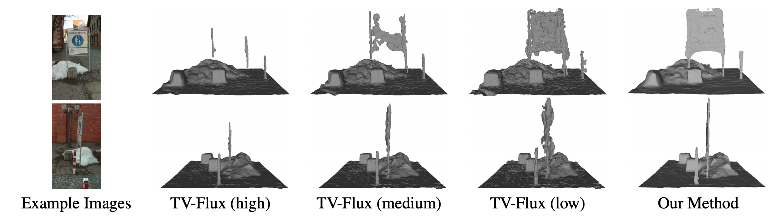
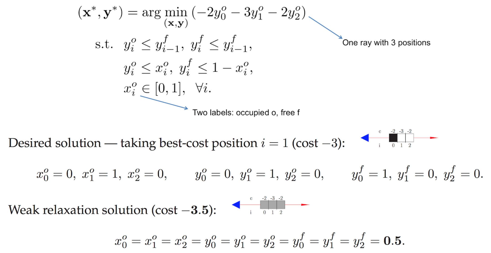

## Semantic 3D Reconstruction with Continuous Regularization and Ray Potentials Using a Visibility Consistency Constraint ##
#### In CVPR 2016 [[Spotlight Video]](https://www.youtube.com/watch?v=z3z4bO2BKhU)

[Nikolay Savinov¹](https://nsavinov.com/), [Christian Haene¹](https://scholar.google.ch/citations?user=AliuYd0AAAAJ&hl=en), [Lubor Ladicky¹](https://inf.ethz.ch/personal/ladickyl/), [Marc Pollefeys¹](https://inf.ethz.ch/personal/marc.pollefeys/) <br/>
¹ETH Zurich <br/>

<p align="center">
  
</p>

This is a Python implementation of the optimization algorithm from our [CVPR 2016 paper on Ray Potentials](https://arxiv.org/abs/1604.02885).
If you use this work, please cite:

    @inproceedings{savinov2016ray,
      title={Semantic {3D} Reconstruction with Continuous Regularization and Ray Potentials using a Visibility Consistency Constraint},
      author={Savinov, Nikolay and Haene, Christian and Ladicky, Lubor and Pollefeys, Marc},
      booktitle={Proceedings of the IEEE Conference on Computer Vision and Pattern Recognition},
      year={2016}
    }

### What this code is

It is a simple example code which allows a user to understand how ray potential optimization works. It is reasonably documented and you can learn how the algorithm works and then implemented it as a part of your own pipeline. It essentially implements the example from Section A.5 of the paper and features two modes of ray optimization: convex and nonconvex. The former was shown not to work in our paper and the latter achieves state-of-the-art results on a few datasets from the Middlebury benchmark and excellently reconstructs thin objects. The difference between the two modes is a single contraint - which we call the Visibility Consistency constraint in the paper - which is essential for the algorithm to work.

### What this code isn't

It is not a complete implementation of a 3D reconstruction pipeline! To make it complete, at least the following things would need to be added:

* Regularization. Our ray potentials paper uses a range of regularizers, from simple TV-L1 to complex Wullf-shape. For real-world 3D reconstruction, regularizers are essential.
* Ray tracing. Even if you are given a depth map, to turn it into a collection of rays, you need to sample them. While conceptually simple, ray tracing could be tricky to implement correctly.
* C++. The field of 3D reconstruction in general relies on heavy computations done fast - which can be more naturally addressed in C++ instead of Python. In particular, one needs to care about cache efficiency.
* OpenMP/GPU. Parallelism across the volume and rays is essential for fast ray potential solvers.

### Task format

Here is how you can specify your own task in the code (see tasks.py):
```Python
def create_task_from_section_a5(task_type):
  # Cell numbering: [[[0, 1, 2]]]
  # Desired solution: [[[0, 1, whatever]]]
  grid_sizes = [1, 1, 3] # 1D example represented in 3D for generality
  rays = [[0, 1, 2]] # linear indices of grid cells are listed for each ray
  gradient_step_size = 1.0 # implicitly specified via cost magnitudes
  ray_costs_occ = [[-2.0, -3.0, -2.0]] # one cost for each position of each ray
  ray_costs_occ = [[val * gradient_step_size for val in costs]
                   for costs in ray_costs_occ]
  ray_costs_free = [0.0] # one cost for every ray
  return {'grid_sizes' : grid_sizes,
          'rays' : rays,
          'ray_costs_occ' : ray_costs_occ,
          'ray_costs_free' : ray_costs_free,
          'nonconvex' : ('nonconvex' in task_type)}
```

The code above specifies the task from Section A.5 which is a simple one-ray example.

### Demo

To run the code:
```Shell
python3 run.py
```
### Demo results interpretation

<p align="center">
  
</p>

For this simple one-ray example, the best solution (as occupancy indicators) would be [0.0, 1.0, whatever]. This solution is printed under "Desired occupancy indicators". Here value 0 means free, value 1 means occupied. So the best solution is to leave the first volumetric cell along the ray free and occupy the second cell. The third cell is thus completely occluded and it does not matter what value it takes. The cost of this solution is -3.

The result of ray potential optimization is shown under "Final occupancy indicators". If you choose the convex mode, what you get is an in-between solution: [0.5, 0.5, >= 0.5]. This is a bad solution: the algorithm does not put the surface anywhere in particular, but rather partially profits from costs everywhere. The cost of this solution is -3.5 and it is better than the cost of the optimal solution above. To cut out this in-between solution, we propose to use a Visibility Consistency constraint. If you enable this mode (nonconvex), you will get the correct solution [0.0, 1.0, whatever].
